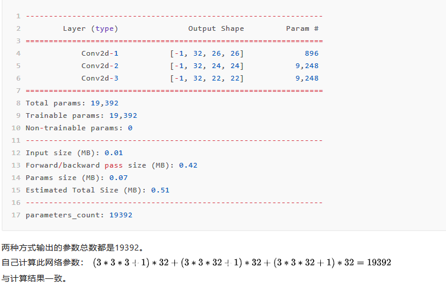
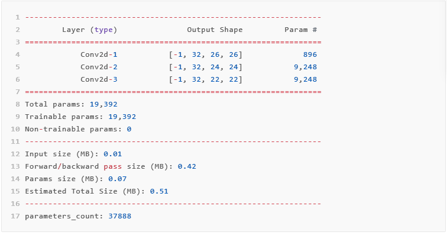

# 类中的方法和属性
方法：也就是各类中定义的函数，比如我们定义一个车的类，描述车的函数就是一个方法。  

属性：车的品牌、型号、生产日期等信息就是它的属性.

## __init__方法：
无需直接调用，生成实例对象的时候自动调用。
“init”的全称是“initialize”，也就是初始化的意思，所以__init__又称构造方法。  

在定义类的时候__init__()方法是必不可少的。 

>(1)双下划线开头的函数为私有函数，不能在类的外部被调用或直接访问；  
>(2)init()，支持带参数的初始化，例如：def init(self,ai_settings,screen)；  
>(3)init()函数的第一个参数必须为self（也可是别的名字），后续参数可自由指定；

init()这种初始化方法，用来初始化新创建对象的属性，在一个对象被创建以后会立即调用，比如像实例化一个类：

``` 
  class Car():
    def __init__(self,make,model,year):    ###
        self.make = make
        self.model = model
        self.year = year 
my_car = Car('aodi','A4','2010')
print(my_car.model)           
```
程序中没有直接调用__init__方法，但make，model，year等属性通过Car()类自动调用了__init__方法，生成了属性。
  
## self参数
“self”实际指的是，类实例对象本身。

同时，由于说到“自己”这个词，都是和相对而言的“其他”而说的；而此处的其他，指的是，类Class，和其他变量，比如局部变量，全局变量等。
此处的self，是个对象（Object），是当前类的实例。
因此，对应的self.valueName 和 self.function()中的valueName：表示self对象，即实例的变量。与其他的，Class的变量，全局的变量，局部的变量，是相对应的。
function：表示是调用的是self对象，即实例的函数。与其他的全局的函数，是相对应的。

因为Python已经规定：**函数的第一个参数必须是实例对象本身，并且约定俗成把其名字写为self。因此我们再定义类中的所有函数时必须传入self参数。** 
```
class Car():
    def __init__(self,make,model,year):    ###
        self.make = make
        self.model = model
        self.year = year 
    def get_descriptive_name(self):
        long_name = self.year+' '+self.make+" "+self.model
        print(self)                    ###看下self指向哪里
        print(type(self))              ###看下self类型是什么
        return long_name
my_car = Car('aodi','A4','2010')
my_car.get_descriptive_name()
```
# Tips:
pytorch只会处理二维数据

# pytorch模型构建
## 模型总体结构

```py
import torch.nn as nn

class MyNet(nn.Module):
    def __init__(self):  #搭建层所需要的信息
        super(MyNet, self).__init__() #继承Mynet到模块去

        "网络的各层具体结构定义"  

    
    def forward(self,x): #神经网络前向传递的过程，真正网络搭建处

        "网络各层的输入输出传递" 
        
```
## 模型定义的具体方法
假设定义一个网络，输入为3通道大小为28*28的图片，经过以下网络输出10分类softmax分类结果：
卷积->卷积->ReLu激活->池化->卷积->卷积->ReLu激活->全连接->全连接->softmax
### 方法一：
```py
import torch.nn as nn

class MyNet(nn.Module):
    def __init__(self):
        super(MyNet, self).__init__()
        self.conv1 = nn.Conv2d(3, 32, 3, 1)
        self.conv2 = nn.Conv2d(32, 32, 3, 1)
        self.relu = nn.ReLU(inplace=True)
        self.pool = nn.MaxPool2d(2)
        self.conv3 = nn.Conv2d(32, 32, 3, 1)
        self.conv4 = nn.Conv2d(32, 32, 3, 1)
        self.dense1 = nn.Linear(2048, 128)
        self.dense2 = nn.Linear(128, 10)
        self.softmax = nn.Softmax()

    def forward(self, x):
        x = self.conv1(x)  # shape = 32,26,26
        x = self.conv2(x)  # shape = 32,24,24
        x = self.relu(x)
        x = self.pool(x)  # shape = 32,12,12
        x = self.conv3(x)  # shape = 32,10,10
        x = self.conv4(x)  # shape = 32,8,8
        x = self.relu(x)
        x = x.view(x.size(0), -1)  # shape = 2048
        x = self.dense1(x)  # shape = 128
        x = self.dense2(x)  # shape = 10
        output = self.softmax(x)
        return output
```
```
打印模型：
>>model = MyNet()
>>print(model)

MyNet(
  (conv1): Conv2d(3, 32, kernel_size=(3, 3), stride=(1, 1))
  (conv2): Conv2d(32, 32, kernel_size=(3, 3), stride=(1, 1))
  (relu): ReLU(inplace=True)
  (pool): MaxPool2d(kernel_size=2, stride=2, padding=0, dilation=1, ceil_mode=False)
  (conv3): Conv2d(32, 32, kernel_size=(3, 3), stride=(1, 1))
  (conv4): Conv2d(32, 32, kernel_size=(3, 3), stride=(1, 1))
  (dense1): Linear(in_features=2048, out_features=128, bias=True)
  (dense2): Linear(in_features=128, out_features=10, bias=True)
  (softmax): Softmax(dim=None)
)
```
其中类似于ReLu激活函数的层在网络中有两种写法：
```
import torch.nn as nn
import torch.nn.functional as F

class MyNet1(nn.Module):
    def __init__(self):
        super(MyNet1, self).__init__()
        self.relu = nn.ReLU(inplace=True)

    def forward(self, x):
        x = self.relu(x)


class MyNet2(nn.Module):
    def __init__(self):
        super(MyNet2, self).__init__()

    def forward(self, x):
        x = F.relu(x,inplace=True)
```
在如上网络中，MyNet1与MyNet2实现的结果是一致的，但是可以看到将ReLU层添加到网络有两种不同的实现，即nn.ReLU和F.ReLU两种实现方法。  

其中nn.ReLU作为一个层结构，必须添加到nn.Module容器中才能使用，而F.ReLU则作为一个函数调用，看上去作为一个函数调用更方便更简洁。具体使用哪种方式，取决于编程风格。在PyTorch中,nn.X都有对应的函数版本F.X，但是并不是所有的F.X均可以用于forward或其它代码段中，因为当网络模型训练完毕时，在存储model时，在forward中的F.X函数中的参数是无法保存的。也就是说，在forward中，使用的F.X函数一般均没有状态参数，比如F.ReLU，F.avg_pool2d等，均没有参数，它们可以用在任何代码片段中。

### 方法二：
```
import torch.nn as nn

class MyNet3(nn.Module):
    def __init__(self):
        super(MyNet3, self).__init__()
        self.layer1 = nn.Sequential(
        	nn.Conv2d(3, 32, 3, 1),
        	nn.Conv2d(32, 32, 3, 1),
        	nn.ReLU(inplace=True),
        	nn.MaxPool2d(2))
        self.layer2 = nn.Sequential(
        	nn.Conv2d(32, 32, 3, 1),
        	nn.Conv2d(32, 32, 3, 1))
        self.fc = nn.Sequential(
        	nn.Linear(2048, 128),
        	nn.Linear(128, 10),
        	nn.Softmax())

    def forward(self, x):
        x = self.layer1(x)
        x = self.layer2(x)
        x = x.view(x.size(0), -1)
        output = self.fc(x)
        return output
```
这种方法利用torch.nn.Sequential（）容器进行快速搭建，模型的各层被顺序添加到容器中。这种方法将多个层放在一起作为一个块运行，比较直观，缺点是每层的编号是默认的阿拉伯数字，不易区分。
```
打印模型：
>>model = MyNet3()
>>print(model)

MyNet3(
  (layer1): Sequential(
    (0): Conv2d(3, 32, kernel_size=(3, 3), stride=(1, 1))
    (1): Conv2d(32, 32, kernel_size=(3, 3), stride=(1, 1))
    (2): ReLU(inplace=True)
    (3): MaxPool2d(kernel_size=2, stride=2, padding=0, dilation=1, ceil_mode=False)
  )
  (layer2): Sequential(
    (0): Conv2d(32, 32, kernel_size=(3, 3), stride=(1, 1))
    (1): Conv2d(32, 32, kernel_size=(3, 3), stride=(1, 1))
  )
  (fc): Sequential(
    (0): Linear(in_features=2048, out_features=128, bias=True)
    (1): Linear(in_features=128, out_features=10, bias=True)
    (2): Softmax(dim=None)
  )
)
```
### 方法三：
```
import torch.nn as nn

class MyNet4(nn.Module):
    def __init__(self):
        super(MyNet4, self).__init__()
        self.layer1 = nn.Sequential()
        self.layer1.add_module('conv1',nn.Conv2d(3, 32, 3, 1))
        self.layer1.add_module('conv2',nn.Conv2d(32, 32, 3, 1))
        self.layer1.add_module('relu1',nn.ReLU(inplace=True))
        self.layer1.add_module('pool1',nn.MaxPool2d(2))

        self.layer2 = nn.Sequential()
        self.layer2.add_module('conv3',nn.Conv2d(32, 32, 3, 1))
        self.layer2.add_module('conv4',nn.Conv2d(32, 32, 3, 1))
        self.layer2.add_module('relu2',nn.ReLU(inplace=True))

        self.fc = nn.Sequential()
        self.fc.add_module('fc1',nn.Linear(2048, 128))
        self.fc.add_module('fc1',nn.Linear(128, 10))
        self.fc.add_module('softmax',nn.Softmax())

    def forward(self, x):
        x = self.layer1(x)
        x = self.layer2(x)
        x = x.view(x.size(0), -1)
        output = self.fc(x)
        return output
```
这种方法是对第二种方法的改进：通过add_module()添加每一层，并且为每一层增加了一个单独的名字。
```
打印模型：
>>model = MyNet4()
>>print(model)

MyNet4(
  (layer1): Sequential(
    (conv1): Conv2d(3, 32, kernel_size=(3, 3), stride=(1, 1))
    (conv2): Conv2d(32, 32, kernel_size=(3, 3), stride=(1, 1))
    (relu1): ReLU(inplace=True)
    (pool1): MaxPool2d(kernel_size=2, stride=2, padding=0, dilation=1, ceil_mode=False)
  )
  (layer2): Sequential(
    (conv3): Conv2d(32, 32, kernel_size=(3, 3), stride=(1, 1))
    (conv4): Conv2d(32, 32, kernel_size=(3, 3), stride=(1, 1))
    (relu2): ReLU(inplace=True)
  )
  (fc): Sequential(
    (fc1): Linear(in_features=128, out_features=10, bias=True)
    (softmax): Softmax(dim=None)
  )
)
```
### 方法四：
```
import torch.nn as nn
from collections import OrderedDict

class MyNet5(nn.Module):
    def __init__(self):
        super(MyNet5, self).__init__()
        self.layer1 = nn.Sequential(
            OrderedDict([
                ('conv1', nn.Conv2d(3, 32, 3, 1)),
                ('conv2', nn.Conv2d(32, 32, 3, 1)),
                ('relu1', nn.ReLU(inplace=True)),
                ('pool1', nn.MaxPool2d(2))
            ]))

        self.layer2 = nn.Sequential(
            OrderedDict([
                ('conv3', nn.Conv2d(32, 32, 3, 1)),
                ('conv4', nn.Conv2d(32, 32, 3, 1)),
                ('relu2', nn.ReLU(inplace=True))
            ]))

        self.fc = nn.Sequential(
            OrderedDict([
                ('fc1', nn.Linear(2048, 128)),
                ('fc1', nn.Linear(128, 10)),
                ('softmax', nn.Softmax())
            ]))

    def forward(self, x):
        x = self.layer1(x)
        x = self.layer2(x)
        x = x.view(x.size(0), -1)
        output = self.fc(x)
        return output
```
这个方法是第三种方法的另外一种写法，通过字典的形式添加每一层，并且设置单独的层名称。  

OrderedDict是python的有序字典，使用OrderedDict会根据放入元素的先后顺序进行排序，所以输出的值是排好序的。 OrderedDict对象的字典对象如果其顺序不同，那么Python也会把他们当做是两个不同的对象。
```
打印模型：
>>model = MyNet5()
>>print(model)

MyNet5(
  (layer1): Sequential(
    (conv1): Conv2d(3, 32, kernel_size=(3, 3), stride=(1, 1))
    (conv2): Conv2d(32, 32, kernel_size=(3, 3), stride=(1, 1))
    (relu1): ReLU(inplace=True)
    (pool1): MaxPool2d(kernel_size=2, stride=2, padding=0, dilation=1, ceil_mode=False)
  )
  (layer2): Sequential(
    (conv3): Conv2d(32, 32, kernel_size=(3, 3), stride=(1, 1))
    (conv4): Conv2d(32, 32, kernel_size=(3, 3), stride=(1, 1))
    (relu2): ReLU(inplace=True)
  )
  (fc): Sequential(
    (fc1): Linear(in_features=128, out_features=10, bias=True)
    (softmax): Softmax(dim=None)
  )
)
```
# 模型的参数共享
假设只有3层卷积的模型有以下两种写法：
```
import torch.nn as nn

class MyNet6(nn.Module):
    def __init__(self):
        super(MyNet6, self).__init__()
        self.conv1 = nn.Conv2d(3, 32, 3, 1)
        self.conv2 = nn.Conv2d(32, 32, 3, 1)
        self.conv3 = nn.Conv2d(32, 32, 3, 1)

    def forward(self, x):
        x = self.conv1(x)
        x = self.conv2(x)
        x = self.conv3(x)
        return x


class MyNet7(nn.Module):
    def __init__(self):
        super(MyNet7, self).__init__()
        self.conv1 = nn.Conv2d(3, 32, 3, 1)
        self.conv2 = nn.Conv2d(32, 32, 3, 1)

    def forward(self, x):
        x = self.conv1(x)
        x = self.conv2(x)
        x = self.conv2(x)
        return x
```
以输入为28*28的3通道图片作为输入，打印模型的参数。pytorch中模型的参数统计输出方法有以下两种:

```
from torchsummary import summary

model = MyNet6()
summary(model,(3,28,28))

"""
=================================================================
"""

def count_parameters(model):
    return sum(p.numel() for p in model.parameters() if p.requires_grad)

print('parameters_count:',count_parameters(model))

```
MyNet6的参数打印两种结果:
  

MyNet7的参数打印两种结果：
  
此时会发现summary方法输出的参数符合计算，但parameters_count方法输出的参数量少了。  

为什么会出现这种问题？要想找到原因肯定是要先了解网络是怎么构建的，从网络构建可以看出，这个网络只初始化了两个卷积层对象——conv1和conv2，然后在网络构建时（forward里面），重复调用了conv2，这样做是因为：根据pytorch官方的教程，这样可以实现参数共享，也就是Conv2d-2 和Conv2d-3 层共享了conv2的参数。也就是其实这里只用了一个卷积层的参数，所以parameters_count 计算的是对的，但是torchsummary为什么计算成了19392？ 那是因为torchsummary 计算时是先把层结构打印下来，然后再统计对各个层的参数求和，这样一来，它不会区分conv2d-2和conv2d-3里面的参数是否相同，只是根据结构都打印且统计了出来。所以在遇到参数共享的时候，torchsummary统计的是不正确的。  
那parameters_count计算出来的结果一定对吗？看下面模型：
```
class MyNet8(nn.Module):
    def __init__(self):
        super(MyNet8, self).__init__()
        self.conv1 = nn.Conv2d(3, 32, 3, 1)
        self.conv2 = nn.Conv2d(32, 32, 3, 1)
        self.conv3 = nn.Conv2d(32, 32, 3, 1)
        self.conv4 = nn.Conv2d(32, 64, 3, 1)

    def forward(self, x):
        x = self.conv1(x)
        x = self.conv2(x)
        x = self.conv3(x)
        return x

```
这里初始化了一个conv4的层，但是在forward函数里没有使用，也就是MyNet8跟MyNet6的结构是等价的，理论参数应该同样为19392。  

MyNet8的参数打印两种结果：

可以发现这个时候，parameters_count方法出现了错误。因为在MyNet8里多初始化了conv4,即使没有在forward里面调用，但是它也算在的model.parameters()里面。  

因此，如果没有共享参数的情况出现尽量用torchsummary来计算，如果出现了共享参数的情况，那就用parameters_count的计算方式，这个时候要注意尽量将没有用到的层对象注释干净，这样才能计算出正确的参数来。

# ModuleList和Sequencial
## nn.ModuleList
ModuleList功能类似于python中的列表（list），可以把nn.Conv2d，nn.Linear等加入到里面去，但与列表不同的是，加入到nn.ModuleList中的模块会注册到网络中，并且里面的层参数也会添加到网络中。举例如下：
```
class net1(nn.Module):
    def __init__(self):
        super(net1, self).__init__()
        self.linears = nn.ModuleList([nn.Linear(10,10) for i in range(2)])
    def forward(self, x):
        for m in self.linears:
            x = m(x)
        return x

net = net1()
print(net)
# net1(
#   (modules): ModuleList(
#     (0): Linear(in_features=10, out_features=10, bias=True)
#     (1): Linear(in_features=10, out_features=10, bias=True)
#   )
# )

for param in net.parameters():
    print(type(param.data), param.size())
# <class 'torch.Tensor'> torch.Size([10, 10])
# <class 'torch.Tensor'> torch.Size([10])
# <class 'torch.Tensor'> torch.Size([10, 10])
# <class 'torch.Tensor'> torch.Size([10])
```
这是一个包含两个全连接层的简单网络，打印网络结构和参数可以看到每层的权值(weights)和偏置(bias)都在网络之内。接下来使用列表：
```
class net2(nn.Module):
    def __init__(self):
        super(net2, self).__init__()
        self.linears = [nn.Linear(10,10) for i in range(2)]
    def forward(self, x):
        for m in self.linears:
            x = m(x)
        return x

net = net2()
print(net)
# net2()
print(list(net.parameters()))
# []
```
使用 Python 的 list 添加的全连接层和它们的 parameters 并没有自动注册到网络中。虽然还是可以使用 forward 来计算输出结果，但是如果用 net2 实例化的网络进行训练的时候，因为这些层的 parameters 不在整个网络之中，所以其网络参数也不会被更新，也就是无法训练。  

除此之外，ModuleList中添加的层没有先后顺序，最终顺序是按照forward函数里面的执行顺序决定，如下：
```
class net3(nn.Module):
    def __init__(self):
        super(net3, self).__init__()
        self.linears = nn.ModuleList([nn.Linear(10,20), nn.Linear(20,30), nn.Linear(5,10)])
    def forward(self, x):
        x = self.linears[2](x)
        x = self.linears[0](x)
        x = self.linears[1](x) 
        return x

net = net3()
print(net)
# net3(
#   (linears): ModuleList(
#     (0): Linear(in_features=10, out_features=20, bias=True)
#     (1): Linear(in_features=20, out_features=30, bias=True)
#     (2): Linear(in_features=5, out_features=10, bias=True)
#   )
# )
```
在ModuleList中，同一个元素（Module、层）也是不能重复使用的，重复使用也会参数共享。
## nn.Sequencial
第二节模型构建的方法中除了第一种是一层层写，其他三种都是利用Sequencial方法。Sequencial方法和keras中的序贯模型很像，与ModuleList不同的是，在模型最终执行时，Sequencial里面的模块（层）会按照顺序执行。并且由于Sequential本身已经实现了forward函数，因此在定义模型的时候，可以不需要forward函数，举例如下：
```
class net5(nn.Module):
    def __init__(self):
        super(net5, self).__init__()
        self.block = nn.Sequential(nn.Conv2d(1,20,5),
                                    nn.ReLU(),
                                    nn.Conv2d(20,64,5),
                                    nn.ReLU())
    def forward(self, x):
        x = self.block(x)
        return x

net = net5()
print(net)
# net5(
#   (block): Sequential(
#     (0): Conv2d(1, 20, kernel_size=(5, 5), stride=(1, 1))
#     (1): ReLU()
#     (2): Conv2d(20, 64, kernel_size=(5, 5), stride=(1, 1))
#     (3): ReLU()
#   )
# )
```
上面的方法是按照模型构建方法进行实现，不使用forward可以这么写：
```
model1 = nn.Sequential(
          nn.Conv2d(1,20,5),
          nn.ReLU(),
          nn.Conv2d(20,64,5),
          nn.ReLU()
        )
print(model1)
# Sequential(
#   (0): Conv2d(1, 20, kernel_size=(5, 5), stride=(1, 1))
#   (1): ReLU()
#   (2): Conv2d(20, 64, kernel_size=(5, 5), stride=(1, 1))
#   (3): ReLU()
# )
```
这种方法省去了定义模型类的过程，这种写法构建的模型与上面net5是等价的。在不需要添加一些其他处理函数（比如全连接层之前的flatten操作：x = x.view(x.size(0), -1)）的情况下可以这么写。  

一般来说，nn.Sequential 的用法是来组成卷积块 (block)，然后像拼积木一样把不同的 block 拼成整个网络，让代码更简洁直观，更加结构化。

## nn.ModuleList和nn.Sequential使用情景
场景一，有的时候网络中有很多相似或者重复的层，一般会考虑用 for 循环来创建它们，而不是一行一行地写，比如：
```
layers = [nn.Linear(10, 10) for i in range(3)]
```
这个时候会想到用ModuleList：
```
class net6(nn.Module):
    def __init__(self):
        super(net6, self).__init__()
        self.linears = nn.ModuleList([nn.Linear(10, 10) for i in range(3)])

    def forward(self, x):
        for layer in self.linears:
            x = layer(x)
        return x

net = net6()
print(net)
# net6(
#   (linears): ModuleList(
#     (0): Linear(in_features=10, out_features=10, bias=True)
#     (1): Linear(in_features=10, out_features=10, bias=True)
#     (2): Linear(in_features=10, out_features=10, bias=True)
#   )
# )
```
这种也可以使用Sequential：
```
class net7(nn.Module):
    def __init__(self):
        super(net7, self).__init__()
        self.linear_list = [nn.Linear(10, 10) for i in range(3)]
        self.linears = nn.Sequential(*self.linears_list)

    def forward(self, x):
        self.x = self.linears(x)
        return x

net = net7()
print(net)
# net7(
#   (linears): Sequential(
#     (0): Linear(in_features=10, out_features=10, bias=True)
#     (1): Linear(in_features=10, out_features=10, bias=True)
#     (2): Linear(in_features=10, out_features=10, bias=True)
#   )
# )
```
需要注意的是第5行的*操作符。它的作用是把一个 list 拆开成一个个独立的元素。但是这个 list 里面的模块必须是按照想要的顺序来进行排列。  

场景二，当需要之前层的信息的时候，比如 ResNets 中的 shortcut 结构，或者是像 FCN 中用到的 skip architecture 之类的，当前层的结果需要和之前层中的结果进行融合，一般使用 ModuleList 比较方便，举例如下：
```
class net8(nn.Module):
    def __init__(self):
        super(net8, self).__init__()
        self.linears = nn.ModuleList([nn.Linear(10, 20), 
                                      nn.Linear(20, 30), 
                                      nn.Linear(30, 50)])
        self.trace = []

    def forward(self, x):
        for layer in self.linears:
            x = layer(x)
            self.trace.append(x)
        return x

net = net8()
input  = torch.randn(32, 10) # input batch size: 32
output = net(input)
for each in net.trace:
    print(each.shape)
# torch.Size([32, 20])
# torch.Size([32, 30])
# torch.Size([32, 50])
```
这里使用了一个列表trace来储存网络每层的输出结果，这样如果以后的层要用的话，就可以很方便地调用了。