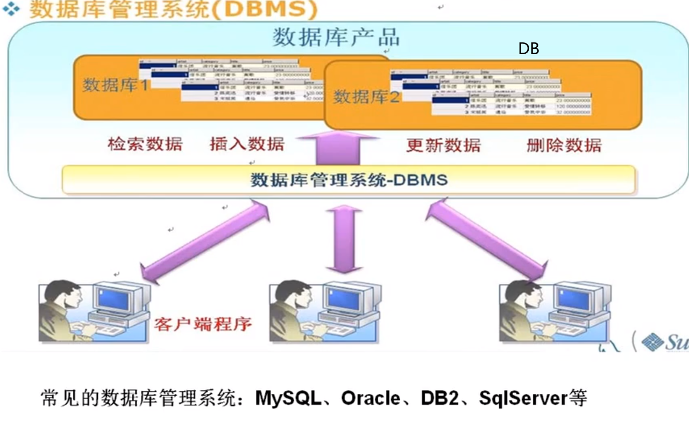

# 数据库
>数据库→服务器→web页

# 数据库的好处 
保存数据的容器：  
>1、数组、集合这些靠内存，易丢失 ；可持久化数据到本地
2、文件不易查找  
3、**数据库**：实现数据持久化;使用完整的管理系统统一管理，结构化查询.

# 数据库的概念
1、DB 数据库，保存一组数据的容器。  
2、BDMS 数据库管理系统，即数据库软件，用于管理DB中的数据。  
BDMS分为两大类：  
-基于共享文件系统的DBMS（Access）  
-基于客户机——c/s服务器的DBMS（MySQL，Oracle甲骨文，Sqlserver微软、DB2国际商用机器公司）

3、SQL 结构化查询语言 ，用于与DBMS通信的语言。   
可以把 SQL 分为两个部分：**数据操作语言 (DML) 和 数据定义语言 (DDL)**   
-几乎所有DBMS都支持SQL  
-简单易学  
-强有力的语言，灵活复杂高级的数据库操作

# 数据库存储数据的特点
>1、将数据放到表中，表再放到库中  
2、一个库中可以有多个表，每个表具有唯一的表名用来标识自己。  
3、表具有一些特性，这些特性定义了数据在表中如何存储，类似java中“类”的设计。  
4、表由列（字段）组成，所有表都是由一个或多个列组成的。列类似java中的“属性”  
5、表中的数据是按行存储的,每一行类似于java中的“对象”。

可以把 SQL 分为两个部分：数据操作语言 (DML) 和 数据定义语言 (DDL)。
SQL (结构化查询语言)是用于执行查询的语法。但是 SQL 语言也包含用于更新、插入和删除记录的语法。

# SQL结构化查询语言

## 数据查询DQL语言：

SELECT - 从数据库表中获取数据
## 更新指令数据操作DML语言： 
UPDATE - 更新数据库表中的数据  
DELETE - 从数据库表中删除数据  
INSERT INTO - 向数据库表中插入数据  

## 创建删除表格构成SQL的数据定义语言 (DDL) 部分
我们也可以定义索引（键），规定表之间的链接，以及施加表间的约束。

CREATE DATABASE - 创建新数据库  
ALTER DATABASE - 修改数据库  
CREATE TABLE - 创建新表  
ALTER TABLE - 变更（改变）数据库表  
DROP TABLE - 删除表  
CREATE INDEX - 创建索引（搜索键）  
DROP INDEX - 删除索引

## 事务控制TCL语言：
事务和事务处理

# MySQL常见命令
1.查看当前所有的数据库  
show databases;  
2.打开指定的库  
use 库名  
3.查看当前库的所有表  
show tables;  
4.查看其它库的所有表  
show tables from 库名;  
5.仓建表  
create table表名(列名 列类型，列名 列类型,。。。);      
6.查看表结构  
desc表名;  
7.查看服务器的版本  
方式一:登录到mysql服务瑞  
select version();  
方式二:没有登录到mysq1服务端  
mysql --version或mysql --v  
8.mysql服务的启动与关闭  
方法一：net start 服务名；net stop 服务名  
方法二：计算机--右击--管理--服务  
方法三：经管理员身份运行命令行。

# MySQL的语法规范
1.不区分大小写,但建议关键字大写,表名·列名小写  
2.每条命令最好用分号结尾  
3.每条命令根据需要，可以进行缩进或换行  
4.注释  
> 单行注释: #注释文字  
   单行注释: --注释文字  
   多行注释: /* 注释文字 */

# 数据库图形化工具
Navicat Premium15

下载官网：https://www.navicat.com.cn/download/navicat-premium  
安装与破解：
https://www.bilibili.com/read/cv5803970  

